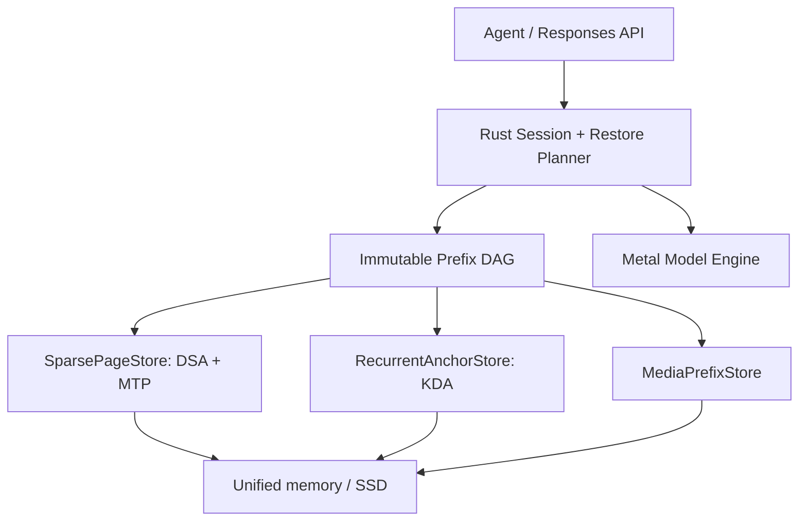
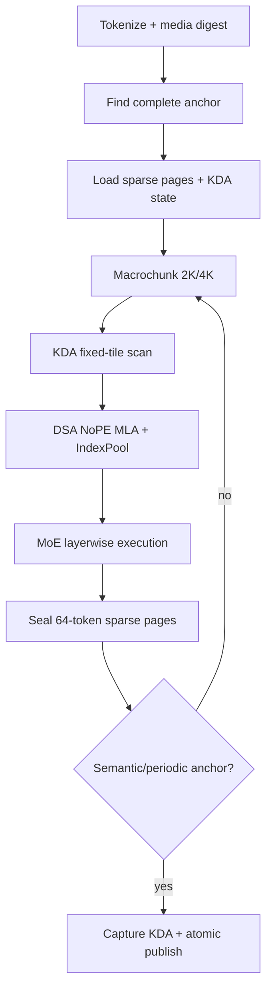

# GLM-5.3-Flash × M3 Ultra 512GB 特化KV-cacheアーキテクチャ探索

調査日: 2026-08-27  
対象: `zai-org/GLM-5.3-Flash` 公式FP8 checkpoint / Apple M3 Ultra 512GB / forkしない新規runtime

## Executive summary

GLM-5.3-Flash向けの最適解は、通常のpaged KV cacheではない。推奨する中核は、次の3種類の状態を別々の物理形式で持ち、immutable manifestだけで原子的に束ねる **Hybrid State Checkpoint DAG** である。

1. **SparsePageStore** — 11層のNoPE sparse MLA/DSAとMTP層を、64-token単位のpage bundleとして保存する。
2. **RecurrentAnchorStore** — 34層のKDA linear attentionを、約73 MiB/sequenceの固定長stateとして、turn・fork・tool境界と周期anchorだけに保存する。
3. **MediaPrefixStore** — vision encoderのprojected embeddingをmedia hashで再利用し、同じspecial token列でも異なる画像を誤hitさせない。

重要なのは、**DSA pageとKDA stateの物理block sizeを揃えない**ことである。vLLMの汎用hybrid allocatorは、attention pageがrecurrent state以上になるまでblockを大きくしてpaddingする。一方、このruntimeはGLM-5.3-FlashとM3 Ultraだけを対象にできるため、異種stateを独立allocatorに分け、snapshot manifestで同期する方が小さく、速く、correctness境界も明確になる。

推奨baselineは以下である。

| 項目 | 初期値 |
| --- | --- |
| DSA logical page | 64 tokens |
| SSD transfer extent | 16 pages = 1024 tokens |
| KDA microchunk | 64または128 tokensを実測選択 |
| scheduler macrochunk | 2048 / 4096 tokensを初期探索 |
| KDA anchor | semantic boundary + 最大replay 8192 tokensから開始 |
| DSA latent cache | BF16で正解系確立後、INT8 group64 |
| IndexPool cache | BF16維持 |
| KDA recurrent/conv state | BF16 baseline、FP32は検証モード |
| MTP | core correctnessとsession lifecycle完成後に有効化 |
| cache identity | checkpoint・token列・media embedding・template・codec・kernel ABIを含むchained hash |
| restore条件 | 全required state groupのstaging/検証後にだけpublish |

この構成では、公式FP8重み約306 GiBを変換せずに読み、M3 Ultraの512 GiB unified memoryに余白を残せる。256K contextのactive cacheは、MTP込みで概算 **BF16 3.19 GiB**、DSA latentだけをINT8 group64にすると **1.73 GiB**である。KDA live stateはcontext長によらず約73 MiB/sequenceである。

## 1. 公式checkpointから確定した前提

### 1.1 modelは「小型GLM-5.2」ではない

[公式model card](https://huggingface.co/zai-org/GLM-5.3-Flash)と[公式config](https://huggingface.co/zai-org/GLM-5.3-Flash/blob/main/config.json)から、text modelは次の構成である。

| 特性 | GLM-5.3-Flash |
| --- | --- |
| 総parameter / active | 約321B / 18B |
| text layers | 45 |
| KDA linear-attention layers | 34 |
| NoPE sparse MLA/DSA layers | 11、layer 3, 7, ..., 43 |
| context | 1,048,576 tokens |
| hidden size | 4096 |
| KDA | 64 heads × K=V=128、short conv kernel=4 |
| MLA latent | `kv_lora_rank=512` |
| RoPE slice | `qk_rope_head_dim=0` |
| DSA IndexPool | key dim 128、pool=4、top-k=2048 |
| MoE | 288 routed experts、top-8、shared expert 1 |
| MTP | 1 next-token-prediction layer |
| mHC | residual streams 4 |
| multimodal | 24-layer vision tower、image/video tokens |

[公式blog](https://z.ai/blog/glm-5.3-flash)は、linear attentionでstate modeling、sparse attentionでglobal retrievalを行い、IndexPoolが4個のindexer keyをweighted poolingで1個に圧縮すると説明している。GLM-5.3との比較ではattention computeを3.0倍、平均BF16 KV sizeを4.4倍削減したとしている。

これはKV subsystemにとって根本的な変更である。GLM-5.2では全層のMLA/DSA token stateが主役だったが、5.3-Flashでは次の2種類に分かれる。

```text
token数に比例: 11 DSA layers × (MLA latent + IndexPool)
固定長:        34 KDA layers × (delta state + q/k/v conv tail)
```

### 1.2 公式FP8は重み形式であり、KV dtypeではない

公式repositoryは約328 GB、runtime上の重みは約306 GiBである。[vLLM recipe](https://recipes.vllm.ai/zai-org/GLM-5.3-Flash)と[KTransformers tutorial](https://github.com/kvcache-ai/ktransformers/blob/main/doc/en/kt-kernel/GLM-5.3-Flash-Tutorial.md)も約306 GiB、少なくとも350 GBのavailable memoryを推奨している。

configの量子化定義は以下である。

```text
quant_method       = fp8
fmt                = e4m3
activation_scheme  = dynamic
weight_block_size  = [128, 128]
```

多数のattention、KDA、mHC、normalization、embedding、lm_head、vision tensorは`modules_to_not_convert`に列挙されている。従ってloaderは「全tensorをFP8と仮定」せず、safetensorsの実dtypeとscale tensorを厳密に読む必要がある。

M3 Ultraでは公式FP8を**canonical storage format**として保持する。公開Metal interfaceにM3のFP8 tensor-core演算を前提にできる根拠はないため、baselineは次のいずれかを実測する。

1. E4M3 byte + 128×128 scaleをkernel内でBF16/FP16へdecodeし、そのままGEMM/GEMVする。
2. layer/expert単位のstaging時だけBF16/FP16へ展開し、複数tokenで再利用する。

全checkpointをBF16化すると約600 GiBになり512 GiBを超えるため、事前変換は設計上禁止する。

### 1.3 checkpoint revisionはcache ABIの一部

調査時点のmainはcommit [`3f1971b7b5f7a528c9c4ef6212c8785298a8c24a`](https://huggingface.co/zai-org/GLM-5.3-Flash/commit/3f1971b7b5f7a528c9c4ef6212c8785298a8c24a)である。このcommitではchat templateのmultimodal token処理やtool result処理が変更された。

[chat template](https://huggingface.co/zai-org/GLM-5.3-Flash/blob/main/chat_template.jinja)は、reasoning effort、thinking retention、tools、image/video/audio markerをtoken列へ反映する。cache keyはmodel weightだけでなく、tokenizer、template、processor、template kwargsのrevisionも固定する。

## 2. 保存すべきstateの正確な境界

### 2.1 Target DSA state

11個のDSA layerごとに以下が必要である。

```text
TargetDsaLayerState
├─ mla_latent[sequence, 512]
├─ index_pool_key[ceil(sequence / 4), 128]
├─ index_pool_tail metadata
└─ codec scales / page metadata
```

`qk_rope_head_dim=0`なのでGLM-5.2にあったRoPE key sliceは不要である。ただしNoPEだからといって任意substringを別prefixへ移植できるわけではない。各tokenのhidden stateは先行contextとKDA stateに依存するため、baseline reuseは同一のchained exact prefixに限定する。

### 2.2 KDA state

[FlashKDA](https://github.com/MoonshotAI/FlashKDA)のinterfaceではrecurrent stateは`[B, H, V, K]`、GLM configでは`H=64, V=128, K=128`である。各linear-attention layerはさらにkernel size 4のq/k/v short convolutionを持つ。

BF16を仮定した1 sequenceの概算は次の通り。

```text
delta state/layer = 64 × 128 × 128 × 2 bytes = 2 MiB
34 layers         = 68 MiB

conv tail/layer   = q,k,v × 64 × 128 × (4-1) × 2 bytes
34 layers         ≈ 4.78 MiB

KDA total         ≈ 72.78 MiB + alignment/header
```

backendによってconv bufferのpackingは変わり得るため、72.78 MiBは設計用の概算である。cache schemaには実buffer descriptorを持たせ、header値から復元する。

### 2.3 MTP state

公式checkpointは1個のMTP layerを持ち、そのlayerにもMLA/DSA indexer tensorがある。`index_share_for_mtp_iteration=true`でも、draft layer固有のKV/indexer stateを省略できるとは解釈しない。

```text
MtpState
├─ draft MLA latent
├─ draft IndexPool key/tail
├─ draft carry / last target hidden（backendが要求する場合）
├─ speculative token buffer
└─ acceptance / sampler state（generation snapshot時）
```

GLM-5.2で確認された「target cacheは正しいがdraft indexerだけ欠けてMTP acceptanceが崩れる」失敗を構造的に禁止する。MTP offとonは別cache compatibility classにする。

### 2.4 Multimodal state

同じ`<|image|>` token列でも画像内容は異なる。token IDだけのhashでは誤hitするため、multimodal prefixは以下をidentityに含める。

```text
media bytes digest
preprocessor config/revision
resize/crop/grid_thw
projector revision
projected embedding digest
multimodal token positions/types
```

vision encoderのprojected embeddingsはKVとは別objectとしてcacheする。これにより同一画像を含むagent sessionでvision prefillを再実行せずに済む。

## 3. 容量モデル

以下は設計値であり、allocator alignment、header、checksum、tail metadataは含めない。IndexPoolは「4 tokenにつきBF16 128次元keyを1個」、INT8はlatent 512要素をgroup64、各scaleをBF16と仮定する。

### 3.1 token当たり

| 構成 | target 11 DSA | target + MTP 12 DSA |
| --- | ---: | ---: |
| BF16 latent + BF16 IndexPool | 11,968 B/token | 13,056 B/token |
| INT8-g64 latent + BF16 IndexPool | 6,512 B/token | 7,104 B/token |

INT8-g64の1 layerは`512 byte + 8 × 2 byte scale = 528 byte/token`である。IndexPoolは`128 × 2 / 4 = 64 byte/token/layer`となる。

### 3.2 context容量

| context | target BF16 | +MTP BF16 | target KV8 | +MTP KV8 |
| ---: | ---: | ---: | ---: | ---: |
| 256K | 2.92 GiB | 3.19 GiB | 1.59 GiB | 1.73 GiB |
| 1M | 11.69 GiB | 12.75 GiB | 6.36 GiB | 6.94 GiB |

これにlive KDA state約73 MiB/sequenceを加える。従って1M context自体は512 GiBで十分小さい。主なmemory riskはKVではなく、306 GiB weights、Metal residency/staging、mHC activations、複数sessionのKDA anchorsである。

### 3.3 64-token page

| page payload | target | +MTP |
| --- | ---: | ---: |
| BF16 | 約748 KiB | 約816 KiB |
| KV8 latent + BF16 index | 約407 KiB | 約444 KiB |

16 pagesを1024-token extentにまとめると、KV8+MTPで約6.94 MiBになる。6〜8 GB/s級SSDに対して十分大きく、64-tokenのprefix照合粒度とlarge sequential I/Oを両立する。

## 4. 推奨アーキテクチャ: Hybrid State Checkpoint DAG



### 4.1 3つの独立allocator

#### SparsePageStore

1個の64-token `SparsePageBundle`を単一slabとして確保する。

```text
SparsePageBundle<64>
├─ header + prefix hash
├─ target_dsa[11][token][latent]
├─ target_indexpool[11][pooled_token][key]
├─ target_indexpool_tail
├─ mtp_dsa[1][token][latent]          optional
├─ mtp_indexpool[1][pooled_token][key] optional
├─ scales / checksums
└─ alignment padding
```

外側をpage、内側をlayer、token、stateとする。各layerの64-token sliceは連続し、Metal kernelはpage tableをgatherする。slab全体は1回のSSD I/Oで移動できる。Indexerを別fileへ分離せず、同一page commitに含める。

#### RecurrentAnchorStore

KDA stateを`KdaAnchorBundle`として保存する。

```text
KdaAnchorBundle
├─ kda_delta_state[34][64][128][128]
├─ q_conv_tail[34]
├─ k_conv_tail[34]
├─ v_conv_tail[34]
├─ exact token length / prefix hash
├─ math mode / tile ABI
└─ checksum
```

これはtoken pageではなく、あるprefix境界の**完全なrecurrent checkpoint**である。

#### MediaPrefixStore

vision encoder outputをcontent-addressed objectにする。LLM prefix manifestはobject digestを参照する。

### 4.2 1種類のpage sizeへ統一しない理由

[vLLM Hybrid KV Cache Manager](https://github.com/vllm-project/vllm/blob/main/docs/design/hybrid_kv_cache_manager.md)は汎用allocatorを単純化するため、recurrent stateを収容できるまでattention block sizeを拡大し、stateを同じpage sizeへpaddingする。[LMCacheのKimi-Linear recipe](https://docs.lmcache.ai/recipes/kimi_linear.html)ではTP=1時にunified block sizeが1888 tokensになる例がある。

GLM-5.3-Flashでこの方針をそのまま使うと、次の問題が起きる。

- prefix reuse granularityがKDA state sizeに引っ張られる。
- 64-token DSA pageの自然な粒度を失う。
- KDA snapshotを過密に保存するとSSD容量が爆発する。
- page paddingがM3 unified memoryを浪費する。
- IndexPool、MTP、media stateの原子性がallocatorの型分岐へ埋もれる。

専用runtimeでは物理allocatorを分離し、manifestのtwo-phase publishでcorrectnessを得る方がよい。

### 4.3 immutable DAGとcopy-on-write

```text
root
└─ system + tool schema anchor
   ├─ branch A anchor
   │  └─ tool result pages
   └─ branch B anchor
      └─ alternate result pages
```

- DSA page、KDA anchor、media objectはimmutable、content-addressedにする。
- snapshotはobject参照だけを持つ。
- fork時は共通prefixをcopyしない。
- childがdecodeを始めた時だけ約73 MiBのmutable KDA working stateを割り当てる。
- branch mergeは行わず、共通ancestorへ戻ってsuffixをprefillする。

## 5. KDAの二重粒度checkpoint

### 5.1 なぜ64-tokenごとにKDAを保存できないか

KDA state約72.78 MiBを64-tokenごとに保存すると、256K sessionで概算291 GiBになる。これはKV削減の利益を消す。

KDA anchorの周期だけを変えた場合の概算は次の通り。

| anchor間隔 | 256K session | 1M session | 最大replay |
| ---: | ---: | ---: | ---: |
| 4K | 4.55 GiB | 18.20 GiB | 4095 tokens |
| 8K | 2.27 GiB | 9.10 GiB | 8191 tokens |
| 16K | 1.14 GiB | 4.55 GiB | 16383 tokens |

8Kを初期値にし、固定値ではなくcost modelで調整する。

### 5.2 semantic anchor

周期anchor以外に、agentが将来branch/restoreする価値の高い境界へ必ずanchorを置く。

- system prompt終端
- tool schema終端
- repository summary終端
- user/assistant turn終端
- tool call直前/結果直後
- image/video block直後
- 明示的`checkpoint`
- `fork`位置

こうすると実workloadではreplay距離が周期上限より短くなる。

### 5.3 KDA stateは差分page化しない

KDAのchunk transitionは入力依存で、各layerの入力hidden state自体が先行KDA/DSA/MoE出力に依存する。token列だけから独立に合成できる汎用delta objectにはならない。Phase 1では完全state snapshotだけを保存する。

lossless compression、量子化snapshot、transition summaryは将来実験に分離する。strict baselineへ混ぜない。

## 6. Restore planner

requested prefix lengthを`L`、完全なKDA anchorを`a <= L`とする。

```text
T_plan(a, L) = T_lookup
             + T_load_sparse_pages(0..a)
             + T_load_kda_anchor(a)
             + T_load_media_objects(0..a)
             + T_install
             + T_prefill(a..L)

T_fresh(L)   = T_prefill(0..L)
```

plannerはcomplete anchor候補ごとに`T_plan`を見積もり、次を満たす最大利益のanchorだけを使う。

```text
T_plan + safety_margin < T_fresh
```

DSA pageが`a`より先まで存在しても、KDA stateがなければそのsuffixを直接skipしない。interleaved KDA stateを再構成するためにfull suffix forwardが必要だからである。

### 6.1 atomic restore

restoreは必ず2段階にする。

1. required objectをstagingへloadする。
2. prefix hash、schema、dtype、length、checksum、kernel ABI、MTP/media dependencyを検証する。
3. 全groupが揃ったanchorだけをactive sessionへpublishする。
4. `a..L`を通常prefillする。

```text
CompleteBundle(a)
├─ all target DSA pages through a
├─ all target IndexPool pages through a
├─ KDA recurrent + conv state at a
├─ MTP DSA + IndexPool through a       if enabled
├─ MTP carry                           if required
└─ all media embeddings through a      if multimodal
```

1つでも欠ければhitを拒否する。partial object数の合計ではなく、先頭から連続したcomplete anchorだけを採用する。

### 6.2 restoreのI/O量

256K、KV8+MTPならsparse stateは約1.73 GiB、KDA anchorは約73 MiBである。6 GB/sの単一SSDでも理論転送時間は約0.31秒、2 driveでうまくstripeできればさらに短い。fresh 256K prefillより十分安くなる可能性が高い。

ただしweight page-inとKV restoreが同じdrive/OS cacheを争う場合は逆効果になり得る。I/O schedulerの優先度は次とする。

```text
WEIGHT_DEMAND > KV_RESTORE > KV_WRITEBACK > GC
```

## 7. Prefill data path



### 7.1 scheduler macrochunkとKDA microchunkを分ける

KTransformersの現行recipeはchunked prefill 2048または4096を使う。一方KDA kernel内部のDPLR/scan tileは小さい方が扱いやすい。

- **macrochunk**: scheduler、activation memory、MoE weight amortizationを決める。候補512/1024/2048/4096/8192。
- **microchunk**: KDAのreduction orderとMetal occupancyを決める。候補32/64/128/256。

checkpoint互換性を保つため、strict modeではmicrochunkとreduction orderを固定する。macrochunkが変わっても同じmicrochunk列として処理する。

### 7.2 KDA Metal kernel

最低限、次を専用kernelとして実装する。

1. FP8/BF16 projection + dynamic activation scaling
2. q/k/v short-conv update
3. gate生成
4. chunkwise KDA scan
5. recurrent state update
6. output normalization/projection

BF16 stateをbaselineにする。FP32 stateはnumeric oracleとquality比較に使う。KDA stateはsequenceごとに独立させ、continuous batchでもrequest間をまたぐreductionを作らない。

### 7.3 DSA/IndexPool Metal kernel

5.3-Flashに限定するため、以下をcompile-time定数にできる。

```text
DSA layers      = 11
latent dim      = 512
rope dim        = 0
index key dim   = 128
index pool      = 4
index top-k     = 2048
logical page    = 64
```

必要kernelは、latent append、IndexPool weighted compression、pooled index scan/top-k、selected latent gather、NoPE MLA attentionである。top-kの同点処理をposition順に固定し、batch compositionで結果が変わらないようにする。

### 7.4 Layerwise prefill

306 GiBの全weightをMetal residencyへ一度に登録する設計は避ける。各layerを順に処理し、attention + router + 実際に必要なexpert tileだけをresidency windowへ入れる。

prefill macrochunkでは多くのexpertが選ばれるため、layer内でtokenをexpert IDごとにbucketし、1回のexpert weight readを多数tokenへ償却する。decodeではtop-8 expertへのrandom demandをhot expert cacheで吸収する。

mHCは4 residual streamsを持つので、macrochunkのactivation予算は概ね`tokens × 4096 × 4 × dtype`から始める。4096-token BF16で約128 MiB、work bufferを含めても512 GiB環境では十分扱える。

## 8. M3 Ultra専用memory/I/O設計

[Appleの仕様](https://support.apple.com/en-us/122211)ではM3 Ultra 80-core GPUは819 GB/s memory bandwidth、最大512 GB unified memoryである。[Metalのstorage mode資料](https://developer.apple.com/documentation/metal/choosing-a-resource-storage-mode-for-apple-gpus)ではApple siliconのdefaultはshared storageである。

### 8.1 tierはCPU/GPUではなくlayoutで分ける

```text
T0 active: Metal-native mutable buffers
T1 warm:   immutable shared-buffer pages/anchors
T2 cold:   SSD extents + manifests
```

CPU DRAMとGPU VRAMを別tierとしてcopyしない。activeとserializedのlayout差、resource residency、SSD I/Oを管理する。

### 8.2 shared bufferをcanonicalにする

初期実装では`MTLStorageModeShared`のpage slabをcanonical representationにする。

- GPUがpageを書き終えたcommand-buffer event後だけCPU serializerが読む。
- pageはseal後immutableにする。
- triple-buffered stagingでcomputeとchecksum/writeをoverlapする。
- private bufferへのcopyは「速いはず」と仮定せず、shared/privateのcounter実測で採否を決める。

### 8.3 residency window

過去のGLM-5.2 Metal実験では大きなeffective residencyがprocess killにつながった。5.3ではweight自体がfitしても、全resourceを同時residentにしない。

```text
resident: current layer + next layer prefetch + active KV + workspaces
mapped:   full official checkpoint
cold:     inactive session pages/anchors
```

Metal 4 residency setsを使う場合も、最初は小さいlayer windowから測定し、GPU fault、resident bytes、command-buffer failureを観測する。

### 8.4 2台のThunderbolt SSD

immutable extentはobject hashで2台へ分散し、OS RAID 0を必須にしない。manifestはobject locationを保持し、queue depthと実効bandwidthからweighted earliest-completionでdriveを選ぶ。

- 1024-token extentを基本I/O単位にする。
- KDA anchor約73 MiBは単独large objectにする。
- manifest/WALは小さく、atomic rename + fsyncでpublishする。
- cache driveが失われてもsessionはrecomputeで回復できる。
- weight shardとKV I/Oの競合をmetrics化する。

## 9. Cache identityとschema

```text
CacheCompatibilityId = hash(
  model_repo_revision,
  weight_manifest_digest,
  tokenizer_digest,
  chat_template_digest,
  processor_digest,
  exact_token_chain,
  media_embedding_chain,
  reasoning_effort / clear_thinking / tool schema,
  state_schema_version,
  DSA codec + scale format,
  KDA dtype + microchunk + reduction order,
  Metal kernel ABI,
  MTP config,
  determinism_class
)
```

token page hashは親page hashを含むchained hashにする。異なるbranchで同じ64-token substringが現れても、先行stateが違えば別objectになる。

## 10. Rust境界

runtime本体はRust control plane + Objective-C/Metal data planeを推奨する。

```rust
pub struct StateSchema {
    pub model_revision: Digest,
    pub dsa_layers: [u16; 11],
    pub kda_layers: [u16; 34],
    pub mtp: Option<MtpSchema>,
    pub sparse_codec: SparseCodec,
    pub kda_dtype: StateDType,
    pub kernel_abi: Digest,
}

pub struct SnapshotManifest {
    pub id: SnapshotId,
    pub parent: Option<SnapshotId>,
    pub token_len: u64,
    pub prefix_hash: Digest,
    pub sparse_root: ObjectId,
    pub kda_anchor: ObjectId,
    pub media_root: Option<ObjectId>,
    pub mtp_root: Option<ObjectId>,
    pub compatibility: Digest,
}

pub trait SessionStore {
    fn checkpoint(&self, session: SessionId, at: u64) -> Result<SnapshotId>;
    fn fork(&self, snapshot: SnapshotId) -> Result<SessionId>;
    fn restore(&self, snapshot: SnapshotId) -> Result<SessionId>;
    fn trim(&self, session: SessionId, to: u64) -> Result<()>;
    fn pin(&self, snapshot: SnapshotId) -> Result<Lease>;
    fn inspect(&self, snapshot: SnapshotId) -> Result<SnapshotManifest>;
}
```

agent-facing Responses APIには少なくとも以下を出す。

```text
session.create
session.checkpoint
session.fork
session.restore
session.release
session.pin / unpin
session.inspect
```

自動prefix reuseは残すが、agentの明示操作を優先する。tool探索前の分岐、失敗した編集からのrollback、長期OpenCode sessionに使える。

新規repositoryは、model graphとcache lifecycleを分ける。

```text
crates/
├─ checkpoint       safetensors/FP8 manifest、revision lock
├─ glm53-model      mHC、MoE、KDA、DSA、MTP、vision graph
├─ metal-kernels    FP8 matmul、KDA scan、IndexPool、sparse MLA
├─ state-schema     required groupとcompatibility ABI
├─ state-store      SparsePage / KDA Anchor / Media object
├─ session-dag      snapshot、fork、lease、GC
├─ scheduler        macrochunk、continuous batch、admission
├─ runtime          model engineとrestore plannerの統合
└─ api              Responses API + explicit session extensions
```

`glm53-model`は`state-schema`を直接実装し、cache managerがtensor名を推測しないようにする。Metal kernelはABI hashとbuffer descriptorを公開し、storeはtensor演算を知らない。この境界なら、将来kernelを更新しても旧cacheを黙って誤読しない。

## 11. Correctnessとdeterminism

hybrid linear attentionは、batch構成やchunk境界で浮動小数点の加算順が変わりやすい。[LMCache recipe](https://docs.lmcache.ai/recipes/kimi_linear.html)もKDA backendがbatch-invariantでない場合を注意している。

このruntimeではcache reuseを信頼できる機能にするため、baselineを`strict`にする。

### strict mode

- KDA microchunkとreduction treeを固定する。
- sequenceごとのscanを独立にする。
- FP8 activation scaleをrow単位で決定し、batch sizeに依存させない。
- router top-kとDSA top-kのtie-breakを固定する。
- page sealはfixed token boundaryのみ。
- kernel ABIが変わればcache missにする。

### fast mode

将来、可変tileやbatch-dependent fusionを許可する場合は別`determinism_class`にし、strict cacheと混ぜない。score-level toleranceだけでよい利用に限定する。

### gate

既存方針を引き継ぎ、最低限次を通す。

| gate | 条件 |
| --- | --- |
| CPU reference vs Metal teacher forcing | 32/32 |
| MoE router identity | 64/64 |
| DSA pooled top-k identity | 64/64、tail含む |
| fresh vs RAM restore greedy | 20/20 |
| fresh vs SSD restore greedy | 20/20 |
| branch/rollback greedy | 20/20 |
| MTP off/on target output | 20/20 |
| MTP restore acceptance | freshとの差を閾値内、indexer欠落を強制試験 |
| multimodal reuse | media hash違いで必ずmiss |

## 12. 実装ロードマップ

### Phase 0 — specification lockとreference

- official revisionをfull hashでpinする。
- safetensors tensor manifest、dtype、shape、scaleを検証する。
- FP8 E4M3 block128×128 decoderをscalar/Rust referenceで実装する。
- MHC、KDA、IndexPool、DSA、MoEの小tensor oracleを作る。
- architectureを保存したtiny checkpointはgraph/loader CIにだけ使い、full correctnessは公式weightで確認する。

完了条件:

- 全tensorが未使用/重複なくmoduleへ割り当たる。
- config/template/processor revisionがcache ABIへ入る。
- 1 layerずつCPU referenceとMetalが一致する。

### Phase 1 — text-only BF16-state runtime

- official FP8を変換せずにloadする。
- mHC + dense/MoE + KDA recurrent decodeを実装する。
- 11 DSA NoPE MLA + IndexPoolを実装する。
- MTP off、single sequence、cacheはBF16のみ。

完了条件:

- 32-token teacher forcing、router、top-k gateを通過。
- 4K/16Kでreference greedy一致。
- resident working setとpage faultを可視化。

### Phase 2 — chunked prefill + RAM Hybrid DAG

- fixed-tile chunkwise KDA。
- layerwise macrochunk prefill。
- 64-token SparsePageBundle。
- semantic + periodic KDA anchor。
- checkpoint/fork/restore/trim/pin。

完了条件:

- restore後のstrict outputがfreshと一致。
- forkはsparse pagesをcopyしない。
- KDA/DSA/IndexPoolのいずれか欠落時にpublishしない。

### Phase 3 — SSDとcost planner

- 1024-token extents、2-drive placement。
- async writeback、checksum、WAL、crash recovery。
- anchor選択とload-vs-recompute planner。
- weight/KV I/O priority。

完了条件:

- 4K/8K/64K/256K restoreでplanner予測誤差を測定。
- cache有効化でp50/p95 TTFTを悪化させない。
- cancellation、drive loss、corrupt extentから安全にrecomputeする。

### Phase 4 — DSA latent KV8

- `kv_lora_rank=512`専用INT8 group64 append/load/gather。
- scaleをpage内にatomic保存。
- IndexPoolとKDAはBF16維持。
- recent tail BF16 / long prefix KV8も比較する。

完了条件:

- quality gateとlong-context retrievalを通過。
- dequant bufferを全pool分materializeせず、attention内でfuseする。
- 256Kでmemory/bandwidth利益が実測できる。

### Phase 5 — MTPとmultimodal

- MTP draft DSA/IndexPool/carryをStateBundleへ追加。
- target index selection sharingを正しく実装。
- media embedding store。
- image/video chat templateとResponses API mapping。

完了条件:

- cache hit前後でMTP acceptanceが維持される。
- MTP sidecar欠落fault injectionを必ず拒否する。
- 同一media reuseと異media missを確認する。

### Phase 6 — continuous batching

- request独立KDA scan。
- mixed hit/miss scheduling。
- macrochunkのpreemption。
- KDA state約73 MiB/active sequenceのadmission control。

完了条件:

- concurrency 1/2/4でstrict cache結果が不変。
- decodeをprefill macrochunkが長時間blockしない。
- branch/fork/cancelでstate leakがない。

## 13. Benchmark matrix

| 軸 | 値 |
| --- | --- |
| prompt | 4K / 16K / 64K / 128K / 256K / 1M |
| KDA microchunk | 32 / 64 / 128 / 256 |
| macrochunk | 512 / 1K / 2K / 4K / 8K |
| anchor interval | semantic only / 4K / 8K / 16K / 32K |
| sparse dtype | BF16 / latent INT8-g64 |
| tier | active / warm unified memory / SSD |
| workload | linear chat / shallow fork / tool fan-out / multimodal |
| concurrency | 1 / 2 / 4 |
| MTP | off / on |

必須metrics:

- fresh/restore/replay token数
- lookup/load/install/replay/TTFT
- DSA page bytes、KDA anchor bytes、media bytes
- effective SSD bandwidthとdrive queue time
- weight demand I/Oとの競合
- Metal resident bytes、GPU fault、command-buffer duration
- layer別KDA/DSA/MoE時間
- KDA state drift、router/top-k identity
- fresh/restore logits、greedy tokens、MTP acceptance
- page/anchor refcount、pin/lease、write amplification

KDA anchor間隔は次のonline costで決める。

```text
anchor_value = expected_restore_frequency
             × saved_replay_time
             - anchor_write_cost
             - retained_bytes × storage_pressure_price
```

固定8Kは最初の比較点に過ぎない。turn境界の頻度と実prefill速度を学習し、sessionごとに調整する。

## 14. 採用しない初期案

### 全層を通常paged KVとして扱う

KDAの固定長stateをtoken比例cacheと誤認するため不採用。

### DSAとKDAを同一page sizeへpaddingする

汎用allocatorには便利だが、専用runtimeではprefix粒度と容量を悪化させるため不採用。

### KDA stateを64-tokenごとに保存する

256Kで約291 GiBになり不採用。

### IndexPoolを省略してlatent KVだけ復元する

DSAの選択結果が壊れるため禁止。

### MTP draft indexerをtarget indexerで代用する

`index_share_for_mtp_iteration`をcache同一性と解釈しない。draft sidecarを明示保存する。

### checkpoint FP8とKV FP8を同一視する

weight量子化とruntime state量子化は品質・kernel・scaleが別であるため禁止。

### 全weightをBF16へ展開する

512 GiBに収まらないため禁止。

### 最初からmulti-node/PD分離する

M3 Ultra単体、agent session lifecycle、strict restoreを優先する。cross-node KDA/DSA transferは対象外。

## 15. 最初の縦切り

最初に完成させるべきものはSSD store全体ではない。次の小さな縦切りである。

```text
official FP8 loader
  → text-only forward
  → BF16 KDA + BF16 DSA/IndexPool
  → 64-token RAM pages
  → 1個のexplicit KDA anchor
  → checkpoint / fork / restore
  → fresh vs restore strict gate
```

ここで「KDA + DSA latent + IndexPoolを完全bundleで復元できる」ことを証明してから、周期anchor、SSD、KV8、MTP、multimodalを順に足す。新規repositoryの価値は、既存runtimeの抽象化を剥がすことではなく、**GLM-5.3-Flashのhybrid stateを最初から正しい中心概念として実装できること**にある。

## Sources

- [GLM-5.3-Flash official model card](https://huggingface.co/zai-org/GLM-5.3-Flash)
- [Official config.json](https://huggingface.co/zai-org/GLM-5.3-Flash/blob/main/config.json)
- [Official chat_template.jinja](https://huggingface.co/zai-org/GLM-5.3-Flash/blob/main/chat_template.jinja)
- [Pinned repository commit, 2026-08-27](https://huggingface.co/zai-org/GLM-5.3-Flash/commit/3f1971b7b5f7a528c9c4ef6212c8785298a8c24a)
- [Z.ai: GLM-5.3-Flash architecture blog](https://z.ai/blog/glm-5.3-flash)
- [Hugging Face Transformers GLM-5.3-Flash docs](https://huggingface.co/docs/transformers/main/en/model_doc/glm5_next)
- [vLLM GLM-5.3-Flash recipe](https://recipes.vllm.ai/zai-org/GLM-5.3-Flash)
- [KTransformers GLM-5.3-Flash tutorial](https://github.com/kvcache-ai/ktransformers/blob/main/doc/en/kt-kernel/GLM-5.3-Flash-Tutorial.md)
- [FlashKDA](https://github.com/MoonshotAI/FlashKDA)
- [Kimi Linear paper](https://arxiv.org/abs/2510.26692)
- [vLLM Hybrid KV Cache Manager](https://github.com/vllm-project/vllm/blob/main/docs/design/hybrid_kv_cache_manager.md)
- [LMCache Kimi-Linear recipe](https://docs.lmcache.ai/recipes/kimi_linear.html)
- [Apple Mac Studio M3 Ultra technical specifications](https://support.apple.com/en-us/122211)
- [Apple Metal resource storage modes](https://developer.apple.com/documentation/metal/choosing-a-resource-storage-mode-for-apple-gpus)
- [SGLang: missing target INDEXER in HiCache](https://github.com/sgl-project/sglang/issues/17085)
- [SGLang: missing draft INDEXER and MTP acceptance regression](https://github.com/sgl-project/sglang/issues/32176)
