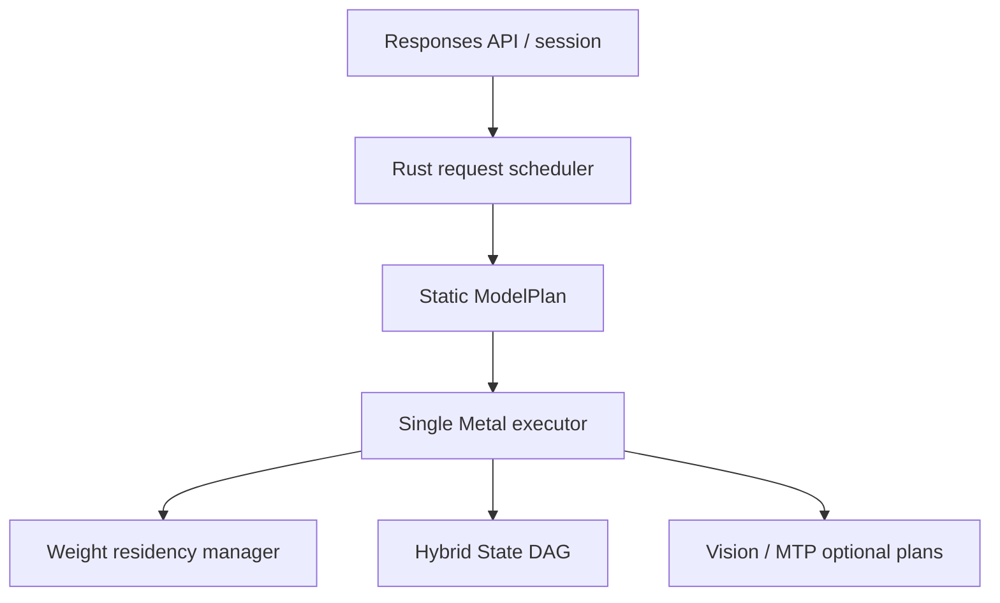

# GLM-5.3-Flash × M3 Ultra 512GB 特化ランタイム・アーキテクチャ探索

調査日: 2026-08-27  
対象: `zai-org/GLM-5.3-Flash` 公式FP8 checkpoint / Apple M3 Ultra 512GB / forkしない新規runtime  
前提: companion report `glm-5.3-flash-m3-ultra-kv-architecture-2026-08-27.md` のHybrid State Checkpoint DAGをcache ABIとして採用

## Executive summary

推奨するのは、汎用graph runtimeを小さく再実装することではない。**GLM-5.3-Flashの45+1層を静的なmodel planへコンパイルし、prefill・decode・MTP verifyを別々のMetal実行計画にlowerする、phase-specialized Rust + Metal runtime**である。

GLM-5.3-Flashは、表面的にはTransformer decoderだが、実行時には次の4系統が同居する。

1. 4本の残差streamを全45層で持ち回るmHC
2. 34層のKDA recurrent linear attention
3. 11層のIndexPool付きNoPE sparse MLA/DSA
4. 42層の288-expert MoEと、独立した1層のMTP drafter

従って最適な抽象化は`TransformerLayer`ではなく、**状態とphaseを型にした静的layer program**である。

```text
KDA, KDA, KDA, DSA, KDA, KDA, KDA, DSA, ... , KDA
  0    1    2    3    4    5    6    7          44
```

設計の結論は以下である。

| 領域 | 推奨判断 |
| --- | --- |
| control plane | Rust。Responses互換API、session/fork/restore、scheduler、I/O、telemetry |
| model representation | official config + safetensors indexから生成するimmutable `ModelPlan` |
| execution | single Metal executor ownership。prefill/decode/MTPを別programにする |
| weights | 公式FP8/BF16をcanonicalのままmmap。全BF16化・全体repackは禁止 |
| Metal residency | target-only text 297.75 GiBをwarmup後all-resident。tensor page-rangeで管理 |
| mHC | 4-stream activation ABI。`FFN post → 次層Attention pre`を融合 |
| KDA | prefillは64/128-token microchunk、decodeは1-token recurrent専用kernel |
| DSA | IndexPoolをfirst-class cache/operator化。dense maskやfull K/Vを生成しない |
| MoE prefill | route → histogram → stable bucket → expert grouped FP8 GEMM |
| MoE decode | all-resident top-8 FP8 GEMV。request横断expert coalesce |
| multimodal | vision towerをlazy loadし、media hashでprojected embeddingをcache |
| MTP | core correctness後のoptional subsystem。target/draft cacheを分離 |
| batching | まず単一長文session、次にsmall continuous batch。TP/EP/PDは実装しない |

既存実装から最も強く採るのは、SGLangの演算分割とcache統合、vLLMのcross-layer mHC fusionとcompact IndexPool、TokenSpeedのprefill/decode別kernel、KTransformersの公式FP8直読とlayerwise phase、Transformersの正解系である。CUDA固有のcollective、graph capture、TP/EP/PD、GPU別backend registryは採らない。

## 1. 調査時点で固定すべきsource

公式blogはSGLang、vLLM、TokenSpeedの対応を案内し、model cardはさらにTransformersとKTransformersを挙げる。ただし2026-08-27時点で、公開sourceの成熟度は同一ではない。

| source | 調査revision | 公開状態 | このruntimeでの役割 |
| --- | --- | --- | --- |
| official checkpoint/config | Hugging Face `zai-org/GLM-5.3-Flash`, repository revision `3f1971b7b5f7a528c9c4ef6212c8785298a8c24a` | 公開main | tensor schema、dtype、model ABIの唯一の正本 |
| Transformers | `modeling_glm5_next.py` current main | 公開main | scalar/eager correctness oracle |
| SGLang | PR [#36507](https://github.com/sgl-project/sglang/pull/36507), head `fa8735a4ff2b2c047b464d2fb3286dfa0aab021f` | open PR + dedicated image | layer composition、KDA/DSA cache wiring、mHC communicator、MTP |
| vLLM | PR [#53906](https://github.com/vllm-project/vllm/pull/53906), head `933876c388fb129ad82590660e6506614559cb86` | open PR、NVIDIA namespace | cross-layer mHC fusion、compact IndexPool/tail、absorbed MLA、loader fusion |
| TokenSpeed | [PR #1259](https://github.com/lightseekorg/tokenspeed/pull/1259), head `af1b7fef74a17fc51d724544f331131ff6af7fe0` | open day-0 PR、recipe公開 | portable phase separation、KPool runtime、streaming loader |
| KTransformers | main `41613064c7ced13e243107219a779eb67d48aec1` | mainにnative support | official FP8 direct load、layerwise prefill、異種weight transport |

重要な含意は、**既存runtimeのclass hierarchyやprivate cache ABIをvendorしない**ことである。day-0 supportは大規模PRであり、SGLang PRでは公開後もHiCache+MTP、hybrid KV pool、backend選択の修正が続いている。新runtimeは次だけをrevision付きfixtureとして取り込む。

- checkpoint tensor名・shape・dtype・scale mapping
- operator equationとforward順序
- tiny-modelおよび公式modelのgolden logits/state digest
- tokenizer、chat template、processor revision
- reference runtimeの起動条件と出力比較記録

## 2. checkpointから復元した正確な実行graph

公式configの主要値は次の通りである。

| 項目 | 値 |
| --- | ---: |
| parameters / active | 約321B / 18B |
| text layers | 45 |
| hidden | 4096 |
| mHC streams / Sinkhorn iterations | 4 / 20 |
| KDA | 34層、64 heads × 128、conv kernel 4 |
| DSA | 11層、layer 3, 7, ..., 43 |
| DSA latent | `q_lora=1536`, `kv_lora=512`, NoPE, `v=256` |
| IndexPool | 32 heads × 128、pool 4、top-k 2048 |
| dense FFN | 最初の3層、intermediate 12288 |
| MoE | 残り42層、288 routed、top-8、shared 1、expert intermediate 2048 |
| MTP | 1 layer、base stackのlayer 45に格納 |
| context | 1,048,576 tokens |
| vision | 24層、hidden 1024、patch 14、temporal 2、merge 2、output 4096 |
| quantization | dynamic E4M3、block 128×128。多数のtensorはBF16/FP32除外 |

### 2.1 1層の順序

Transformersのforwardから、target layerの意味順序は次である。

```text
mHC attention-pre → RMSNorm → KDAまたはDSA → mHC attention-post
→ mHC FFN-pre → RMSNorm → dense FFNまたはMoE → mHC FFN-post
```

ただしこの順序をそのまま8個の独立kernelにしない。vLLM実装が示すように、ある層の`FFN-post`は次層の`attention-pre + RMSNorm`と融合できる。推奨Metal ABIは次である。

```text
layer 0: hc_expand + attention_pre + norm
layer i: attention
         fused(attention_post, ffn_pre, norm)
         ffn
layer i+1 entry:
         fused(previous ffn_post, attention_pre, norm)
last:   ffn_post + hc_contract(mean) + final_norm
```

公式checkpointのmHC tensorは約67.5 MiBのBF16で、reference runtimeはこれをFP32 parameterへloadする。Metal baselineはcheckpoint BF16をcanonicalに保ち、係数生成と20回のSinkhornをFP32 accumulationで行う。Sinkhornをhost loopや20 launchに分解せず、4×4をthreadgroup内で完結させる。mHC activationはBF16なら`4 × 4096 × 2 = 32 KiB/token`であり、4096-token macrochunkは1 bufferあたり128 MiBとなる。1M token分を保持せず、macrochunkのdouble bufferだけを持つ。

### 2.2 KDA layer

KDAは次を一つのoperator familyとして扱う。

```text
logical merged projection: q, k, v, beta, f_a, g_a
q/k/v depthwise causal conv (kernel 4)
q/k normalize
Kimi Delta recurrent update (FP32 accumulation path)
output gate + per-head RMSNorm
o_proj
```

SGLang、vLLM、TokenSpeedはcheckpoint上で分離された投影をloader側で融合し、q/k/v convも連結する。M3 runtimeでは全weightを物理連結して複製する必要はない。`TensorRef { shard, offset, dtype, scale_ref }`の配列を1個のMetal kernel descriptorへ渡し、**論理融合、物理zero-copy**を優先する。物理sidecarを作るのは、実測でlaunch/descriptor overheadが支配的かつ追加resident bytesがbudget内のtensorだけに限定する。

prefillとdecodeのkernelは別にする。

- `kda_prefill_chunk`: 64/128-token microchunk、chunk間state carry、FP32 recurrent accumulation、chunk境界digestを出力
- `kda_decode_1`: conv tail更新、1-token delta update、gate、RMSNormを融合
- `kda_replay`: anchorから最大8192 tokenを再生するcache restore用。計算式はprefillと同じだがI/O priorityが異なる

KDA stateの保存dtypeはcompanion KV reportどおりBF16 baseline、FP32は検証modeとする。BF16なら34層のdelta+conv stateは約73 MiB/sequence、FP32 deltaだけなら約136 MiBへ増える。演算accumulation dtypeと永続state dtypeをABI上で分離する。

### 2.3 NoPE sparse MLA/DSA layer

Transformers実装はcorrectness確認には有用だが、runtime雛形にはできない。`kv_b_proj`でlatentを全headのK/Vへ展開し、top-kからdense sparse maskを作るため、1M contextで不要なmemory trafficを生む。

推奨DSA pipelineは次である。

```text
hidden
├─ q_a + norm → q_b ───────────────────────────────┐
├─ kv_a(512) → latent page write ──────────────────┤
└─ indexer: q / normalized key / head weights      │
     → Hadamard → pool=4 write/tail → top-k=2048 ─┤
                                                   ▼
                          selected sparse MLA over latent pages
                          → absorbed output projection
```

IndexPoolはmask generatorではなくfirst-class operator/cacheとする。

- pooled historyと未完成tailを別物理領域にする
- indexer score/重みはFP32を維持し、rankingの揺れを避ける
- top-k index workspaceはMetal kernelのtile幅に合わせる。ただしlogical top-kは2048のまま
- 選択後はlatent pageを直接gatherし、full K/Vや`[query, context]` maskを作らない
- MTP step 1以降は`index_share_for_mtp_iteration=true`に従い、step 0の選択を再利用できる

1M contextのtarget DSA latentだけでBF16約11 GiBであり、weight 306 GiBに比べ管理可能である。runtime riskは容量より、random gather、IndexPool ranking、restore時のtarget/draft整合性である。

### 2.4 MoE

MoEはこのruntimeの性能中心である。各routed expertは概算で、FP8 weight本体だけなら次になる。

```text
gate + up + down = 3 × 4096 × 2048 bytes = 24 MiB/expert/layer
top-8             = 192 MiB/MoE-layer/token
42 MoE layers      = 7.875 GiB/token（routed expertだけの下限）
shared expert      = 約0.984 GiB/token相当/42層
```

これは重複cache hit、batch内expert reuse、scale、router、attention、embeddingを含まない解析下限である。それでもdecode性能はKVよりweight residencyとFP8 GEMV効率に支配されることが分かる。

#### Prefill MoE plan

1. macrochunk全tokenのrouterをFP32で計算する
2. noaux/sigmoid/correction bias/renormalizeを公式式どおり適用する
3. `(expert_id, token_id, weight)`をhistogramし、expert単位でstable bucketする
4. all-resident expert rangeを使い、block-FP8 grouped GEMMを行う
5. token順へscatter-addし、shared expertを加える

TokenSpeedのMI350経路は、decode用compact FP8とprefill用BF16 copyを同時に常駐させる。別GPU memoryを持つserverでは有効だが、M3 Ultra 512GBでは全expertの二重化を禁止する。採るのは**同じFP8 canonical weightに対するphase別kernel**という考え方だけである。

#### Decode MoE plan

1. active requestをまとめてrouter計算
2. request横断でexpert idをcoalesce
3. expertごとのtoken rowをまとめ、all-resident FP8 GEMV/GEMMを実行する
4. tokenごとの8結果を最後にreduceする

GLM-5.2 FP8 streamingで有効だったcompletion-order demandとresident cap 8は、通常経路には採用しない。GLM-5.3-Flashのtarget-only text weightは297.75 GiBなので、512 GB unified memoryでは全target expertをwarmup時にprefaultし、sustained decode中のmajor faultを0にする。cap 8 LRUはOS memory pressure時に明示的に切り替えるdegraded modeだけに残し、通常運転へ自動混入させない。投機的なnext-layer expert prefetchも不要である。

### 2.5 MTP

MTPはbase stackのmHCを使わない独立した1層programである。

```text
token embedding + captured target hidden
→ e/h norm + concat + eh_proj
→ DSA + MoE
→ shared head norm + lm_head
```

targetとは別のlatent KV、IndexPool、tail、accepted lengthを持つ。`index_share_for_mtp_iteration`はdraft iteration間のindex選択再利用であり、target IndexPoolの共有ではない。

既往のM3実測ではMTP D1がwall time +22.65%、bytes +24%で不採用だった。従ってMTPはruntime ABIには最初から場所を確保するが、既定offとし、acceptanceで増えたtoken数が追加weight trafficを上回る場合にだけ有効化する。

### 2.6 Vision

vision towerは24層のBF16 pathであり、text FP8 kernelと混ぜない。

- image/video inputがないserver startではload/resident化しない
- media bytes + processor revision + grid metadataでprojected embeddingをcacheする
- projected 4096-d embeddingをplaceholder位置へ挿入後、text prefillへ渡す
- videoは全frame embeddingを常駐させず、processor chunkとtext macrochunkのbackpressureを連動させる

## 3. 参照実装から採るもの・採らないもの

| runtime | 採る | 採らない |
| --- | --- | --- |
| Transformers | exact forward順、cache update式、vision placeholder処理、CPU oracle | full K/V展開、dense sparse mask、Python hot path |
| SGLang | 既存GLM/DeepSeek/Kimi部品の構成法、RadixLinearAttention、mHC state machine、HiCache+MTPの失敗知見 | CUDA communicator、TP/EP、generic allocator、backend選択表 |
| vLLM | deferred mHC post、cross-layer post+pre fusion、IndexPool+tail分離、absorbed MLA、MTPのunsummed pair | NVIDIA専用model namespace、graph capture、PP/TP前提、永続BF16 dequant copy |
| TokenSpeed | KPool runtime、prefill/decode別path、streaming loader、phase別MoE representationの発想 | CUDA/ROCm stream graph、全expert BF16 prefill copy、distributed mapping compiler |
| KTransformers | official FP8 direct load、layerwise prefill、double-buffer transport、routing統計 | CPU+CUDA split、PCIe H2D protocol、AVX512/AMX expert kernel |

特にKTransformersのlayerwise prefillは、M3では「CPUからGPUへweightを転送する」形で移植しない。Apple Siliconでは同じ物理memoryを共有するため、対応物は**layer/expert単位のresident declaration、prefault、lifetime終了通知**である。

## 4. 推奨runtime topology



### 4.1 process ownership

| component | ownership / responsibility |
| --- | --- |
| API tasks | HTTP streaming、tool-call boundary、cancel、backpressure |
| session manager | prefix DAG、fork、pin、checkpoint/restore、sampler state |
| request scheduler | prefill/decode queue、macrochunk、small batch形成、deadline |
| model executor thread | Metal command queueとtemporary arenaを単独所有 |
| residency manager | mmap tensor view、page-range prefault、warm residency gate、memory-pressure監視 |
| state I/O lanes | restore > checkpoint writebackのpriority queue。weight I/Oは起動warmupだけ |
| telemetry | per-op time/bytes、major fault、resident bytes、expert reuse率、cache replay |

Pythonはgolden生成と開発toolに限定し、serving hot pathへ入れない。Metal command bufferの所有者を1 threadにすることで、allocator lifetime、resource hazard、cancel時の状態publishを単純化する。

### 4.2 crate/module境界

```text
runtime-api       Responses互換、stream event、tool boundary
model-manifest    HF config/safetensors/tokenizer/template fingerprint
model-plan        45 target + 1 MTP + visionの静的typed plan
weight-store      mmap、TensorRef/ExpertRef、FP8 scale、page-range residency
metal-backend     pipeline cache、command encoder、arena、counter sampling
kernels-mhc       pre/post/fused post-pre/contract
kernels-kda       prefill/decode/replay
kernels-dsa       latent write、IndexPool、select、sparse MLA
kernels-moe       router、bucket、FP8 GEMM/GEMV、scatter/reduce
hybrid-state      SparsePage/RecurrentAnchor/MediaPrefix/manifest atomicity
scheduler         macrochunk、continuous batch、I/O priority、cancel
oracle            CPU reference、golden fixture、state digest comparator
```

`model-plan`はruntime起動時の動的Python graphではなく、configとtensor indexから生成するRust dataである。

```rust
enum AttentionPlan {
    Kda(KdaPlan),
    SparseMla(DsaPlan),
}

struct LayerPlan {
    layer_id: u8,
    attention: AttentionPlan,
    ffn: FfnPlan,
    mhc: MhcPlan,
    tensors: LayerTensorRefs,
}
```

生成時に45層のpattern、全tensor shape/dtype/scale、MTP layer 45、vision placeholder idを検証し、`ModelPlanFingerprint`をHybrid State cache keyへ入れる。

## 5. 3つのexecution plan

### 5.1 PrefillPlan

prefillは2048/4096-token scheduler macrochunkを初期候補とし、KDA内部だけ64/128-token microchunkへ分ける。

```text
tokenize / media embedding
→ macrochunk activation double buffer
→ 45-layer static program
   ├─ mHC fused boundaries
   ├─ KDA microchunks + recurrent carry
   ├─ DSA latent/IndexPool page append + sparse attention
   └─ MoE route/bucket/grouped FP8 GEMM
→ page/anchor staging
→ macrochunk単位のatomic state publish
```

macrochunkはmemory capだけでなく、以下の観測値でadaptする。

- Metal working-set high-water mark
- MoE expert reuse率とresident miss bytes
- DSA gather bandwidth
- KDA microchunk kernel occupancy
- cancellation latency

初期は既往の「prefill chunk 4でno-loss gate通過」を維持し、実装上のmacrochunk 2048/4096との対応をbenchmark manifestで明記する。chunk sizeを単一の曖昧な整数にせず、`scheduler_macrochunk`、`kda_microchunk`、`weight_stream_window`を別設定にする。

### 5.2 DecodePlan

decodeは1-token/batch-smallへ完全特化する。

```text
embed → target 45-layer program
→ logits/sampler
→ optional MTP draft/verify
→ state delta commit → stream token
```

- mHC cross-layer fusionでlaunchと4-stream read/writeを減らす
- KDA recurrent+convをin-place updateするが、token commit前はshadow deltaとする
- DSAはIndexPool tail update後、top-k selected latentだけ読む
- MoE requestを小さくbatchし、expert id横断coalesceを行う
- cancellation/error時は未publish state deltaを破棄する

目標15 tok/sでは1 tokenのbudgetは66.7 msである。45層平均に均等配分すると1.48 ms/layerしかなく、MoE missを逐次SSD readする設計は成立しない。公式weight全体はmmap canonicalとしてmemory内へ保持し、decode中の「load」はdisk transferではなくresident/prefault管理にする。

### 5.3 RestoreReplayPlan

cache restoreはDecodePlanへ直接buffer pointerを差す処理ではない。

1. manifest identityと全required groupを検証
2. target DSA、draft DSA、IndexPool tail、KDA anchor、media embeddingをstaging
3. safe prefixを全groupの最小位置へ切る
4. 必要ならKDA anchorからmicrochunk replay
5. target/draft state digestを検証
6. executor-visible handleを一度だけpublish

restoreのMetal kernelはprefill equationを再利用するが、scheduler classは独立させる。interactive decodeをrestore/replayが長時間blockしないよう、command buffer境界でpreemptできる長さにする。

## 6. weight storeとunified-memory設計

### 6.1 公式safetensors headerの物理監査

repository revision `3f1971b7b5f7a528c9c4ef6212c8785298a8c24a`のindexと62 shardのheaderをrange requestだけで集計した。重み本体のdownloadは行っていない。

```text
tensors       76,108
shards        62
data bytes    328,326,771,576 = 305.778 GiB
FP8 storage   292.805 GiB
BF16 storage   12.901 GiB
F32 storage     0.073 GiB  （主にweight_scale_inv）
```

Hugging Faceのparameter metadataはF32 model parameterを295,518要素と数えるが、safetensors headerにはFP8の`weight_scale_inv`もF32 tensorとして格納される。loaderのcapacity計算にはparameter countでなくdata offset差を使う。

| physical category | bytes |
| --- | ---: |
| target routed experts | 283.569 GiB |
| target KDA | 8.723 GiB |
| MTP全体 | 6.979 GiB |
| embedding + lm_head | 2.363 GiB |
| target DSA MLA + Indexer | 1.528 GiB |
| vision | 1.050 GiB |
| target shared experts | 0.985 GiB |
| first 3 dense FFN | 0.422 GiB |
| target router | 0.092 GiB |
| target mHC checkpoint tensor | 0.066 GiB |

visionとMTPを除くtarget-only textは**297.750 GiB**、routed expertはtargetだけで全checkpointの92.74%、MTPを含めると94.94%である。このため通常運転の設計は次で固定する。

- target-only text weightを起動warmup後all-residentにする
- MTP 6.979 GiBとvision 1.050 GiBはfeature activation時にlazy-prefaultする
- 1M contextのHybrid Stateを加えても、全checkpointをBF16展開しない限り512 GB内に十分なworking marginがある
- warmup後のsustained decodeでmajor faultが出たらperformance gate失敗とする

shardはresidency単位にできない。shard 1–2はMTPとembedding/lm_head/target KDAが混在し、shard 62もvision約1.05 GiBとtarget KDA約0.125 GiBが混在する。従ってfile単位の`madvise`ではなく、tensorのpage range単位でprefault/lifetimeを管理する。

expert layoutも単一連続領域とは仮定しない。12,384 expert bundle（43 MoE層×288）のうち12,383は6 tensorが同じshardにあり、例外はMTP layer 45のexpert 197だけである。ただしsample headerでは、各expertの3×8 MiB weightは連続する一方、3×2 KiB scaleはshard先頭側の別rangeに置かれていた。`ExpertRef`は少なくともweight spanとscale spanを分け、cross-shard例外も表現する。

```rust
struct ExpertRef {
    weight_spans: SmallVec<[TensorSpan; 3]>,
    scale_spans: SmallVec<[TensorSpan; 3]>,
    checkpoint_dtype: DType,
}
```

このdescriptorなら公式layoutをrepackせず、router結果から必要な3 weightと3 scaleを直接参照できる。

### 6.2 canonical layout

公式repositoryは約328 GB、runtime weightは約306 GiBである。全BF16展開は約600 GiBとなり、512 GiB機では禁止する。

```text
safetensors shard mmap
  └─ TensorRef(offset, shape, stride, dtype)
       ├─ optional FP8 scale TensorRef (128×128 block)
       ├─ Metal shared-buffer view
       └─ residency/lifetime metadata
```

`modules_to_not_convert`は名前のprefix guessで処理せず、safetensors headerの実dtypeとscale tensor存在を正本にする。config除外listは検証用constraintとして使う。

### 6.3 residency class

| class | 例 | policy |
| --- | --- | --- |
| target text | routed/shared experts、KDA/DSA、embedding、lm_head | warmup後297.750 GiBをall-resident |
| Metal working views | 現在層のbuffer window/argument table | command buffer lifetimeだけactive |
| optional | vision 1.050 GiB、MTP 6.979 GiB | feature activation時にlazy-prefault |
| degraded expert bank | memory-pressure時だけ | 明示modeのdemand LRU。通常は使用禁止 |
| state | active Hybrid State pages/anchors | session priorityとpin policy |

macOSのVM page cacheとMetal residencyを同一視しない。次を別metricにする。

- virtual mapped bytes
- physically resident bytes
- Metal resource bytes in active command buffers
- prefault bytes / major fault count
- optional/degraded evictable bytes
- active cache bytes

`MTLDevice.maxBufferLength`、`MTLBuffer` zero-copy可否、page alignment、safetensors shard境界を起動時に検査する。約5 GiBのshardが1 bufferに入らないdeviceでは、mmapをpage-aligned `BufferWindow`へ分割し、tensorをwindow+offsetで参照する。zero-copy不可のtensorだけpage-aligned stagingへ入れ、staging copyはtensor/layer lifetimeで解放する。checkpoint全体の複製へ昇格させない。

## 7. scheduler policy

最初の製品目標は「1個の長いOpenCode sessionを安定して15 tok/s以上」であり、datacenter throughputではない。

優先順位は次に固定する。

1. interactive decodeとstate delta commit
2. tool-return後の短い append prefill
3. cache restore/replay
4. new long prefill
5. checkpoint writeback/compaction

small continuous batchはMoE expertの計算reuseとGEMV→small GEMM化を増やす範囲で導入する。weightは既にresidentなので、batchingの目的をI/O hit率と混同しない。batchを増やしてmHC activation、KDA state、tail workspaceが膨らみinteractive latencyが悪化したら打ち切る。最初からTP、EP、PP、prefill-decode disaggregation、RDMAを設計へ持ち込まない。

fairnessはtoken数ではなく、推定bytesとresident churnを含むcostで測る。

```text
cost = projected weight bytes
     + DSA gather bytes
     + KDA replay bytes
     + activation working bytes
```

## 8. correctnessと性能gate

### 8.1 correctness ladder

| level | test |
| --- | --- |
| 0 manifest | 全tensor key/shape/dtype/scale、config pattern、revision fingerprint |
| 1 operator | mHC、KDA、IndexPool、sparse MLA、router、expert、visionをTransformersと比較 |
| 2 layer | KDA層/DSA層/dense層/MoE層をBF16 CPU oracleと比較 |
| 3 tiny model | tiny GLM-5.3 configでprefill/decode/cache restoreをcross-runtime比較 |
| 4 official model | teacher forcing 32/32、router top-k 64/64、16-token exact sequence |
| 5 chunk invariance | unchunked vs 64/128 KDA microchunk、2048/4096 macrochunk |
| 6 state lifecycle | append/fork/restore/cancel/pin、target+draft atomicity、media identity |
| 7 long context | 256K→1Mでtop-k tail、page boundary、anchor replay、no-swap |

float bit-exactを全operatorへ要求するのではなく、次のhard gateを分ける。

- token exact / router top-k exact / IndexPool selected-id exact
- logits max/mean error
- KDA recurrent state digest error
- restore後の次token一致
- MTP acceptanceとtarget output一致

Transformersは正解式、SGLang/vLLM/TokenSpeedは高速実装比較に使う。reference同士が不一致なら多数決せず、公式equationとcheckpoint dtypeへ戻る。

### 8.2 performance gate

| gate | 合格条件 |
| --- | --- |
| memory | warmup後のsustained decode中swap・major faultなし。target text 297.750 GiB resident |
| decode | target-onlyで15 tok/s以上を最低線、p50/p95を別記録 |
| prefill | 既往no-loss baselineを維持し、chunk変更でtoken差なし |
| residency | warmup後major fault 0。通常modeではexpert prefetch/LRUが無効 |
| cache | restoreがfull re-prefillより明確に速く、次token一致 |
| MTP | 追加bytesを含めtarget-only wall timeを改善する場合だけdefault候補 |
| multimodal | 同一media embedding reuse、異なるmediaで誤hitなし |

各benchmark recordへmodel fingerprint、macOS、Metal compiler、kernel ABI、macro/microchunk、resident bytes、major fault、context、sampling seedを保存する。

## 9. 実装順序

### Milestone 0 — source freeze / oracle

- official checkpoint manifestと`ModelPlan` generator
- Transformers由来のCPU operator oracle
- SGLang/vLLM/TokenSpeed各revisionのgolden fixture
- tokenizer/template/processor fingerprint

### Milestone 1 — official FP8 loader / Metal primitives

- safetensors mmap、E4M3 block128 decoder、BF16 path
- RMSNorm、linear、SwiGLU clamp、router、mHC 4×4 Sinkhorn
- Metal countersとresident telemetry

### Milestone 2 — target text decode

- static 45-layer plan
- KDA decode、DSA IndexPool/select/sparse MLA
- target-only text 297.750 GiB warm residency gate
- MoE all-resident top-8 FP8 GEMV
- teacher-forcing/token exact gate

### Milestone 3 — prefill

- mHC chunk double buffer
- KDA 64/128 microchunk
- DSA direct latent append
- MoE route/bucket/grouped FP8 GEMM
- 2048/4096 adaptive macrochunk

### Milestone 4 — Hybrid State integration

- SparsePageStore、RecurrentAnchorStore、MediaPrefixStore
- atomic bundle publish、fork/restore/cancel
- SSD extent、priority I/O、long-session compaction

### Milestone 5 — multimodal / API

- lazy vision tower、image/video processor
- projected media cache
- Responses streaming、tool boundary、session pin

### Milestone 6 — batching / MTP

- small continuous batching、expert coalescing
- MTP target/draft cache、verify
- target-only gateを通過した場合だけMTP default化

## 10. 明示的に禁止する設計

- official checkpointの全BF16変換、全tensor事前repack
- Transformers同様のfull K/V展開とdense sparse mask
- KDA/DSAを同じpaged-cache blockへpaddingして格納
- mHCを各層でexpand/contractする実装
- prefill/decodeで同じMoE kernelと同じchunk policyを強制
- 288 expertのBF16 copyをprefill用に常駐
- warmupなしでpage fault任せにdecodeを開始すること
- target weightが収まる通常modeでexpert demand LRU/prefetchを使うこと
- MTPをcore correctnessの依存関係にすること
- CUDAのTP/EP/PD/collective抽象化を単機Metalへ持ち込むこと
- open day-0 PRのprivate ABIを新runtimeのpublic ABIにすること

## 11. 最終推奨

実装を始めるなら、最初の垂直sliceは**text-only、target-only、batch 1、decode 16 tokens**にする。ただしmock layerではなく、最初から公式FP8 loader、45層のmHC/KDA/DSA/MoE、Hybrid State handleを通す。これで後から置き換え不能なABIを早期に検証できる。

最も価値の高い最初のMetal kernel群は次の5個である。

1. `mhc_fused_post_pre_norm`
2. `kda_decode_conv_delta_gate_norm`
3. `indexpool_write_select`
4. `sparse_mla_selected_latent`
5. `moe_fp8_top8_gemv`

その後にprefill用`kda_chunk`と`moe_fp8_bucketed_gemm`を追加する。この順なら、decodeの15 tok/s、state ABI、公式FP8のzero-copy/residencyという最も不確実で価値の高い仮説を先に潰せる。

## Primary sources

- [Z.ai: GLM-5.3-Flash announcement](https://z.ai/blog/glm-5.3-flash)
- [Official model card](https://huggingface.co/zai-org/GLM-5.3-Flash)
- [Official config](https://huggingface.co/zai-org/GLM-5.3-Flash/blob/main/config.json)
- [Transformers GLM-5 Next model](https://github.com/huggingface/transformers/blob/main/src/transformers/models/glm5_next/modeling_glm5_next.py)
- [SGLang GLM-5.3-Flash PR #36507](https://github.com/sgl-project/sglang/pull/36507)
- [vLLM GLM-5.3-Flash PR #53906](https://github.com/vllm-project/vllm/pull/53906)
- [vLLM deployment recipe](https://recipes.vllm.ai/zai-org/GLM-5.3-Flash)
- [TokenSpeed deployment recipe](https://tokenspeed.readthedocs.io/en/latest/models/glm53-flash.html)
- [KTransformers GLM-5.3-Flash tutorial](https://github.com/kvcache-ai/ktransformers/blob/main/doc/en/kt-kernel/GLM-5.3-Flash-Tutorial.md)
- [FlashKDA](https://github.com/MoonshotAI/FlashKDA)
